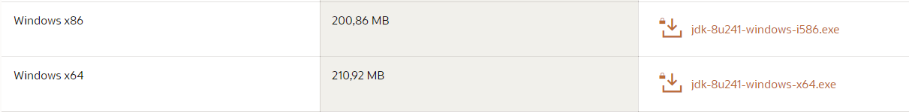

# UTS-Pengenalan-Big-Data
1.	Tiga DBMS yang bisa digunakan untuk mengolah Big Data.  
•	Cassandra  
 atau lengkap APACHE CASSANDRA adalah salah satu produk open source untuk menajemen database yang didistribusikan oleh Apache yang sangat scalable (dapat diukur) dan dirancang untuk mengelola data terstruktur yang berkapasitas sangat besar (Big Data) yang tersebar di banyak server. 
•	MySQL  
adalah salah satu aplikasi yang termasuk vendor DBMS yang merupakan salah satu aplikasi umum dan paling banyak digunakan oleh pengguna data maupun para programmer. Salah satu alasan mengapa MySQL banyak digunakan karena aplikasi ini terkenal sebagai open source atau gratis. Jadi, Anda tidak akan dikenakan biaya apapun ketika mengunduh maupun juga mengoperasikannya. 
•	MariDB 
adalah aplikasi DBSM yang merupakan aplikasi database dari MySQL. Aplikasi ini tercipta melalui inisiatif oleh para pengembang atau developer yang mana sebelumnya mereka menggunakan MySQL. Alasan pembuatan MariaDB adalah karena telah diakuisisinya MySQL oleh pihak Oracle yang membuat produk ini menjadi produk properietary. 
2.	Mebuat sebuah database Hotel dengan acuan pencarian Points Of Interest. 
•	Desain database secara RDBMS. 
  
•	Desain database secara model Cassandra. 
 
 
•	Proses instalasi apache Cassandra di Windows (10) 
•	Download java versi 1.8 sesuai dengan yang dibutuhkan Cassandra, apabila menggunakan versi yang lain akan terjadi error atau Cassandra tidak akan bisa dijalankan 
  
•	Kemudian download python dengan versi 2.7  
  
•	Setelah java dan python sudah terinstal pastikan kembali sudah terdeteksi oleh sistem. 
  
•	Proses mendownload cassandra 
  
•	Setelah menginstal java, python, dan Cassandra sudah di download masukan directori file nya ke dalam PATH pada Envoirment System. 
  
•	Buat variable baru untuk JAVA dengan nama JAVA_HOME. 
   
•	Buat variable baru. Kemudian masukan direktori python kedalam path envoirment system. 
   
•	Buat juga variabel baru untuk memasukan direktori Cassandra dengan nama CASSANDRA_HOME. 
  
•	Setelah semua variable diubuat, buka Command Promt dengan admin. Jalankan perintah “cassandra” untuk menjalankan mesin apache Cassandra.
  
•	Setelah apache Cassandra terkoneksi, buka command promt lagi untuk menjalankan perintah Cqlsh ntuk memulai shell SQL. 
  
 •	Membuat tabel pada Cassandra 
  
  
  
•	Proses input data dan menampilkan data pada table yang sudah dibuat. 
  
  
  
  
  
•	Proses Update data dan menampilkan data pada tabel. 
Sebelum update 
 
Setelah di update 
 
•	Proses menghapus dan menampilkan data pada tabel. 
 

#Arsitektur 
Cassandra di desain awal untuk menghandle Big Data yang terdiri dari banyak titik-titik (node) yang terpisah-pisah dan saling bekerjasama nyaris tanpa ada kesalahan. 
Cassandra memiliki peer-to-peer sistem terdistribusi di seluruh node, dan data didistribusikan di antara semua node dalam sebuah cluster. 
Semua node dalam sebuah cluster memainkan peran yang sama. Setiap node independen dan pada saat yang sama saling berhubungan ke node lain. 
Setiap node dalam sebuah cluster dapat menerima membaca dan menulis permintaan, terlepas dari mana data sebenarnya terletak di cluster. 
Ketika sebuah node performanya turun, membaca permintaan / tulis dapat dilayani dari node lain dalam jaringan. 
Replikasi data di Cassandra disebut dengan istilah Gossip Protocol dimana satu atau lebih node dalam sebuah Cluster sebagai replika untuk bagian tertentu dari data. Jika terdeteksi bahwa beberapa node datanya out of date, Cassandra akan mengembalikan nilai terbaru untuk klien. Setelah mendapatkan nilai kembalian terbaru, Cassandra melakukan perbaikan membaca di latar belakang untuk memperbarui nilai-nilai yang out of date. 
Gambar berikut menunjukkan bagaimana Cassandra menggunakan replikasi data antara node dalam sebuah cluster untuk memastikan tidak ada satu titik yang mengalami kegagalan. 
<b>Konsep Replication Antar Node Cassandra<b>  

#Komponen 
Cassandra mempunyai beberapa komponen utama yaitu :
•	Node : ini adalah server tempat penyimpanan data.
•	Data Center : kumpulan dari beberapa node.
•	Cluster : Kumpulan dari beberapa data center.
•	Commit Log : adalah log dari proses penulisan di Cassandra , yang berfungsi juga sebagai Crash Recovery Mechanism.
•	Mem-Table : Adalah memory-resident data structure. Setelah menulis dalam commit log , cassandra melakukan penulisan di sini.
•	CQL : Cassandra Query Language , adalah bahasa perintah query di cassandra .

